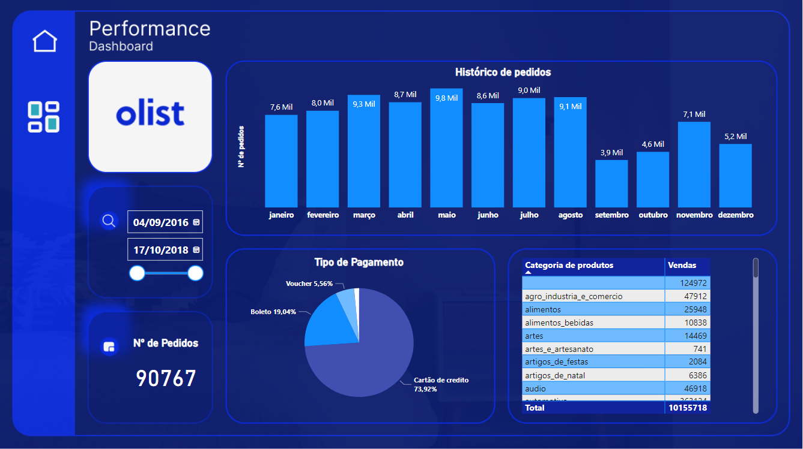

Projeto publicado -<a href="https://app.powerbi.com/view?r=eyJrIjoiZDFmZGY0OTEtMzlmZS00YzUzLThiOTgtOTM3OWRmMjc1Y2IzIiwidCI6IjdlOTNlMjg2LWIyOWEtNDQ1NC1hNDFhLWU4NDE5ZWM5ZGViNSJ9"> Dashboard Performance Pedidos</a>

Para a construção do dashboard, foi realizada a etapa essencial de entender o negócio e os KPI. A obtenção dos dados ocorreu em diferentes fontes, incluindo conexões com MySQL, CSV e JSON. O tratamento dos dados foi realizado no Power Query, o que envolveu o gerenciamento de parâmetros, estabelecimento de relacionamentos e pequenos ajustes em linguagem M. O design do painel foi elaborado no Figma, resultando em um layout atraente. Com base nesse design, o dashboard foi montado e criado um layout específico para dispositivos móveis. Por fim, o conteúdo foi publicado, tornando-o acessível para a equipe e demais interessados. 

O dashboard inclui as seguintes informações:

* Logo do cliente, para identificação visual da empresa ou marca.
* Cartão de total de pedidos, mostrando o número total de pedidos realizados no período de análise.
* Filtro de segmentação de informações, permitindo que o usuário selecione e filtre os dados com base em critérios específicos, como datas ou categorias.
* Histórico de Pedidos, que exibe uma linha do tempo dos pedidos realizados, permitindo analisar tendências e padrões ao longo do tempo.
* Tipos de pagamentos, com uma representação visual dos diferentes métodos de pagamento utilizados nas transações.
Quantidade de vendas por categoria de produtos em tabela, apresentando uma visão detalhada das vendas agrupadas por categorias de produtos.

http://surl.li/jhqah
